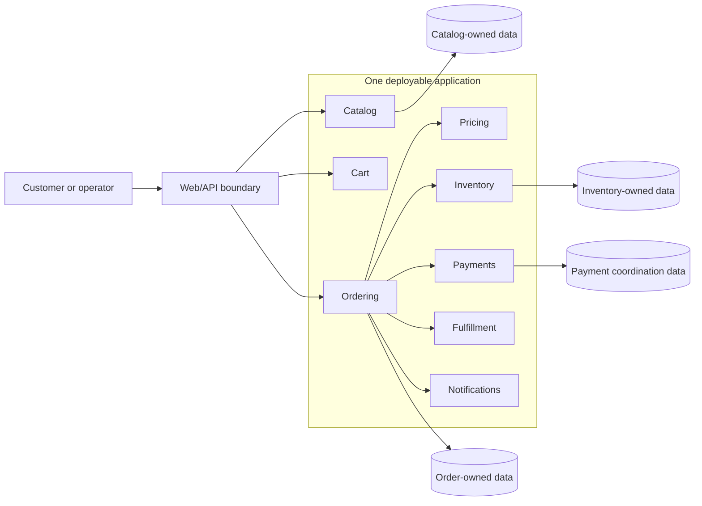
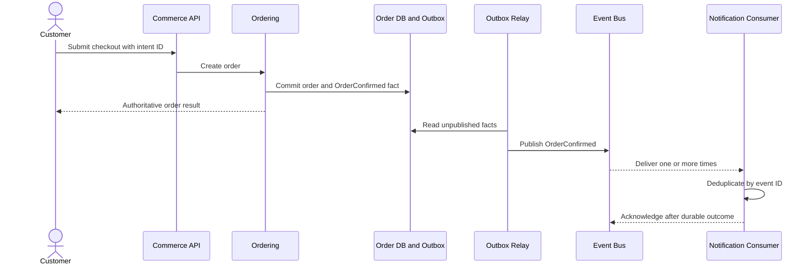
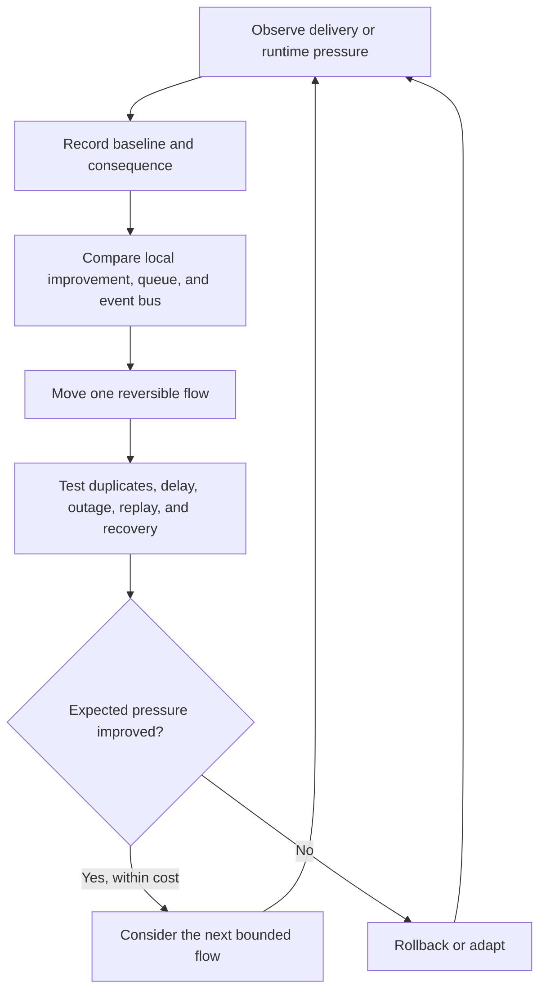

# Architecture Diagrams

These diagrams express responsibility and evolution. They do not prescribe a
programming language, broker, database, or deployment platform.

## Version 1: Modular Monolith

The single deployment simplifies transactions and operations. Module-owned data
and explicit contracts preserve a migration option without paying distributed
systems cost prematurely.

## Version 2: One event-driven pilot

## Evolution decision loop

